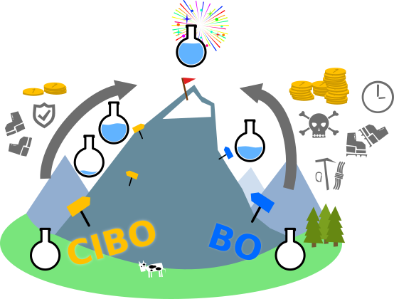
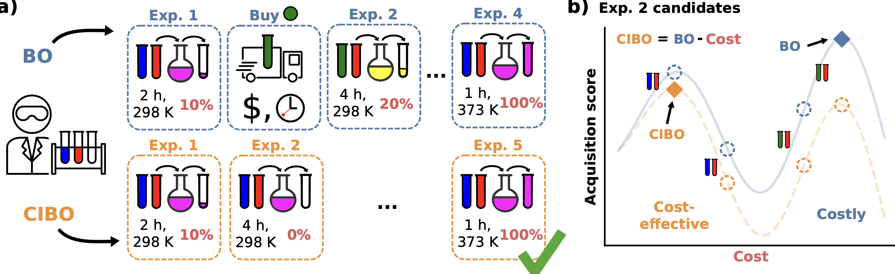

# Cost-Informed Bayesian Reaction Optimization (CIBO) a.k.a. Rules of Acquisition


[PREPRINT:](https://chemrxiv.org/engage/chemrxiv/article-details/66220e8a21291e5d1d27408d)


Authors:

Alexandre A. Schoepfer, Jan Weinreich, Ruben Laplaza,Jerome
Waser, and Clemence Corminboeuf

## Motivation
_Inspired by the Star Trek universe following Ferengi's 3rd rule of acquisition - "Never spend more for an acquisition than you have to," and the 74th rule - "Knowledge equals profit," we introduce strategies for cost-efficient BO to find a good cost and yield increase compromise._


## Abstact
Bayesian optimization (BO) of reactions becomes increasingly important for advancing chemical discovery. Although effective in guiding experimental design, BO does not account for experimentation costs. For example, it may be more cost-effective to measure a reaction with the same ligand multiple times at different temperatures than buying a new one. We present Cost-Informed BO (CIBO), a policy tailored for chemical experimentation to prioritize experiments with lower costs. In contrast to BO, CIBO finds a cost-effective sequence of experiments towards the global optimum, the “mountain peak”. We envision use cases for efficient resource allocation in experimentation planning for traditional or self-driving laboratories.



CIBO vs BO. BO suggests a direct and steep path with expensive climbing equipment and a higher chance of costs for suffering injuries. CIBO suggests a slightly longer but safer path with lower equipment costs needed for the ascent.

## What problem are we solving?
Add a crucial dimension to the BO: the cost and ease of availability of each compound used at each batch iteration.



Overview of standard BO (blue) vs. _cost-informed Bayesian optimization_ (CIBO, orange) for yield optimization.

 (a): BO recommends purchasing more materials. Meanwhile, CIBO balances purchases with their expected improvement of the experiment, at the cost of performing more experiments (here five vs. four). 

(b): A closer look at the two acquisition functions of BO and CIBO for the selection of experiment two. In CIBO, the BO acquisition function is modified to account for the cost by subtracting the latter. Following the blue BO curve, the next experiment to perform uses green and red reactants (corresponding to the costly maximum on the right). Subtracting the price of the experiments results in the orange CIBO curve, which instead suggests the more cost-effective experiment on the left (blue and red reactants).


## Installation

Best to create a new environment, for instance with


```
conda create --name cibo python=3.10
```

then:

```
conda activate cibo
pip install .
```

That's it!

## Tutorial
Open the file 


`tutorial.ipynb` 

To learn how to load the datasets shown in the paper and, more importantly, how to perform a cost-informed Bayesian Optimization with your own data.
Your data must come in a `CSV` file. For instance, for the direct arylation dataset we would have:


```
from cibo.data.datasets import user_data

description = {
    "compounds": {
        "1": {"name": "Ligand_SMILES", "inp_type": "smiles"},
        "2": {"name": "Base_SMILES", "inp_type": "smiles"},
        "3": {"name": "Solvent_SMILES", "inp_type": "smiles"},
    },
    "parameters": {
        "1": {"name": "Concentration", "inp_type": "float"},
        "2": {"name": "Temp_C", "inp_type": "float"},
    },
    "cost": {"name": "Ligand_Cost_fixed", "inp_type": "float"},
    "target": {"name": "Yield", "inp_type": "float"},
}

data = user_data(csv_file=my_data_path, description=description)

X, y = data.X, data.y
```

Simply specify the location of your file, the compound columns (you can have arbitrarily many) as well as reaction parameters such as the temperature or the concentration.
Finally, also specify the costs and which column corresponds to the reaction yield.

## Reproduce results from paper

For each experiment, the parameters are set with the `config.py` file in the same directory.
A subfolder `figures` will be created after executing and results will be plotted and saved as
png in this folder. In addition results are saved in a pkl file `results.pkl`.

### Initialization with cheapest ligand

Figure 3: 

```
cd /cibo/AcqFuncPrice/CheapInit/DirectAryl
python costs_min.py
```

Figure 5
```
cd /cibo/AcqFuncPrice/CheapInit/Baumgartner
python costs_min.py
```
### Weight factor for including costs


Figure S2

```
cd /cibo/AcqFuncPrice/CostWeight
python costs_min.py
```

### Random initialization

Figure S3

```
cd /cibo/AcqFuncPrice/RandomInit
python costs_min.py
```

## Repository Structure

The folder `cibo` has the following subfolders:

### `data`
Currently supports two different datasets:
Direct arylation (DA) [1] and Cross-coupling (CC) [2] with yields ranging from 0–100%. To add your own dataset create a preprocessing script similar to `data/baumgartner.py` or `data/directaryl.py` and add the option to load your data to the `Evaluation_data` class in `data/datasets.py`
The datasets are called "BMS" and "baumgartner" respectively, as a keywork in the `exp_config.py` files.


### `RegressionDemo`

Regression on both datasets resulting in a scatter plot with errorbars (`correlation.png`). All regressors are compatible with `botorch`: 

Gaussian Process Regression: `GPR.py` Try the effect of different kernels: `Tanimoto` kernel performs quite well and is the default choice. Optionally also try Random Forest regression `RFR.py` interfaced with `sklearn`.

To change the dataset `"dataset"`, initialization scheme (`"init_strategy"`) and number of training points `"ntrain"` open the `exp_configs_1.py` file. Other keywords have no effect on these two scripts and are only relevant for the Bayesian optimization runs.

### `AcqFuncPrice`

Reproduce figures from the paper: for the two different datasets `Baumgartner` and `DirectAryl`.
In both cases the scripts work identically, the main difference is the `config.py` scripts that control the configurations that should be tested. Therein a list is defined and the experiments are performed subsequently:

```
benchmark = [
    {
        "dataset": "BMS",
        "init_strategy": "worst_ligand",
        "cost_aware": True,
        "n_runs": 5,
        "n_iter": 30,
        "batch_size": 5,
        "ntrain": 200,
        "prices": "update_ligand_when_used",
        "surrogate": "GP",
        "acq_func": "NEI",
        "label": "BMS_COST_GP_NEI",
        "cost_mod": "minus",
        "cost_weight" 1.0
    }
    ...
]
```
`dataset`: "BMS" for DirectArylation or "baumgartner" for the Baumgarnter dataset.

`init_strategy`: "worst_ligand" when using "BMS" literally means start with the ligand with worst overall yield given all other reaction conditions. "cheapest" when using "baumgartner", start with cheapest commercially available compounds. "random" is also an option but was not used for the BO/CIBO in the paper

`cost_aware`: `True` = CIBO, `False` = BO

`n_iter`: number of BO/CIBO iterations

`batch_size`: batchsize for each BO/CIBO iteration

`ntrain`: maximal number of points for initialization.

`prices`: "update_ligand_when_used" was the option used for the paper. After buying any compound keep it in stock, only pay once

`surrogate`: Currently GaussianProcess `GP` and RandomForest `RF` are supported

`acq_func`: Type of acquisition function, tested "Noisy expected improvement" `NEI`

`cost_mod`: Selected modification of the original acquisition function to include the cost. "minus" corresponds to results in paper.

`label`: label used for the output files.

`cost_weight`: parameter $\lambda$ controls the weighting between yield optimization and reducing the costs of the optimization. For $\lambda=0$ CIBO is equivalent to normal BO, for $\lambda>0$  costs are taken into account, increasing $\lambda$ puts more weight on reducing the costs. If not mentioned otherwise, we set $\lambda = 1.0$ (see SI Section S4 for additional details). Default $\lambda =1.0$


### FiguresPaper

Generate the result plots for the paper.


### Scripts for modified cost-informed BO

`BO.py` contains all functions and classes a fit a surrogate model

`update_model`: Update and return a GP model with new training data from scratch.

`Surrogate_Model`:  Surrogate model class that supports different types of kernels and surrogate methods and model fitting


### `misc`
- **Content**: Space for experimental or outdated items.


## Contributions
We welcome contributions and suggestions!


## :scroll: License
This project is licensed under the MIT License


## References
[1] Shields, B. J.; Stevens, J.; Li, J.; Paras-
ram, M.; Damani, F.; Alvarado, J. I. M.;
Janey, J. M.; Adams, R. P.; Doyle, A. G.
Bayesian reaction optimization as a tool
for chemical synthesis. Nature 2021, 590,
89–96.

[2] Baumgartner, L. M.; Dennis, J. M.;
White, N. A.; Buchwald, S. L.;
Jensen, K. F. Use of a droplet plat-
form to optimize Pd-catalyzed C–N
coupling reactions promoted by organic
bases. Org. Process Res. Dev. 2019, 23,
1594–1601


_Das Zeitmaß, in dem er lebte, es hatte keine Begrenzung, es hatte keine Zwischenzeiten und keine Intervalle, es war eine ungeheure, gleichmäßige Dauer, die wie eine silberne Welle unendlich über den Horizont lief, und in der Stunden, Tage, Jahre, eine Ewigkeit aufgesogen wurden, ohne dass man ihres Verlustes gewahr wurde._