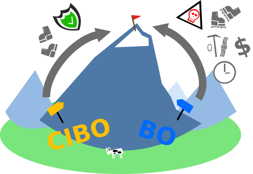
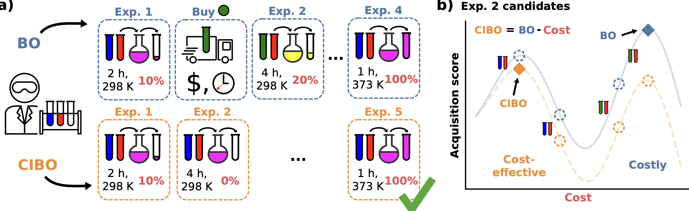

# Cost-Informed Bayesian Reaction Optimization (CIBO) a.k.a. Rules of Acquisition

## Motivation
_Inspired by the Star Trek universe following Ferengi's 3rd rule of acquisition - "Never spend more for an acquisition than you have to," and the 74th rule - "Knowledge equals profit," we introduce strategies for cost-efficient BO to find a good cost and yield increase compromise._


## Abstact
Bayesian optimization (BO) of reactions becomes increasingly important for advancing chemical discovery. Although effective in guiding experimental design, BO does not account for experimentation costs. For example, it may be more cost-effective to measure a reaction with the same ligand multiple times at different temperatures than buying a new one. We present Cost-Informed BO (CIBO), a policy tailored for chemical experimentation to prioritize experiments with lower costs. In contrast to BO, CIBO finds a cost-effective sequence of experiments towards the global optimum, the “mountain peak”. We envision use cases for efficient resource allocation in experimentation planning for traditional or self-driving laboratories.



## Introduction
Add a crucial dimension to the BO: the cost and ease of availability of each compound used at each batch iteration.


Overview of standard BO (blue) vs. _cost-informed Bayesian optimization_ (CIBO, orange) for yield optimization.

 (a): BO recommends purchasing more materials. Meanwhile, CIBO balances purchases with their expected improvement of the experiment, at the cost of performing more experiments (here five vs. four). 

(b): A closer look at the two acquisition functions of BO and CIBO for the selection of experiment two. In CIBO, the BO acquisition function is modified to account for the cost by subtracting the latter. Following the blue BO curve, the next experiment to perform uses green and red reactants (corresponding to the costly maximum on the right). Subtracting the price of the experiments results in the orange CIBO curve, which instead suggests the more cost-effective experiment on the left (blue and red reactants).


## Installation

Python dependencies:

```
torch
gpytorch
botorch
rdkit
matplotlib
sklearn
numpy
```
Best to create a new environment (tested with python 3.8.16. and botorch 0.8.1)
```
pip install -r requirements.txt
```


After setting up an envirnment with these packages, add
```
git clone git@github.com:lcmd-epfl/cibo.git
export PYTHONPATH=$PYTHONPATH:$HOME/rules_of_acquisition
```
to your `.bashrc` file. Then, run
```
source ~/.bashrc
```


## Repository Structure

### `RegressionDemo`


Perform various regression tasks on the Pd-catalyzed C-H arylation dataset resulting in a scatter plot with errorbars (`correlation.png`). 
All regressors are compatible with `botorch`: 

Gaussian Process Regression: `GPR.py` Try the effect of different kernels: `Tanimoto` kernel performs quite well and is the default choice.

### `AcqFuncPrice`

Reproduce figures from the paper: for the two different datasets.


### `misc`
- **Content**: Space for experimental or outdated items.


## Contributions
We welcome contributions and suggestions!


## :scroll: License
This project is licensed under the MIT License


## References
[1] ChemArxiv